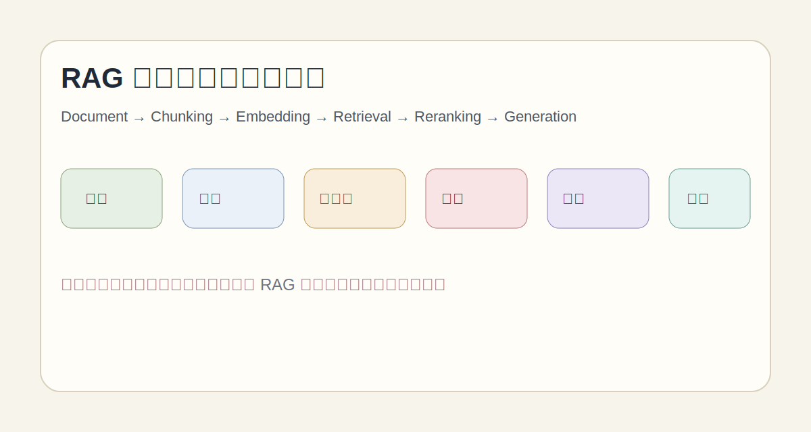
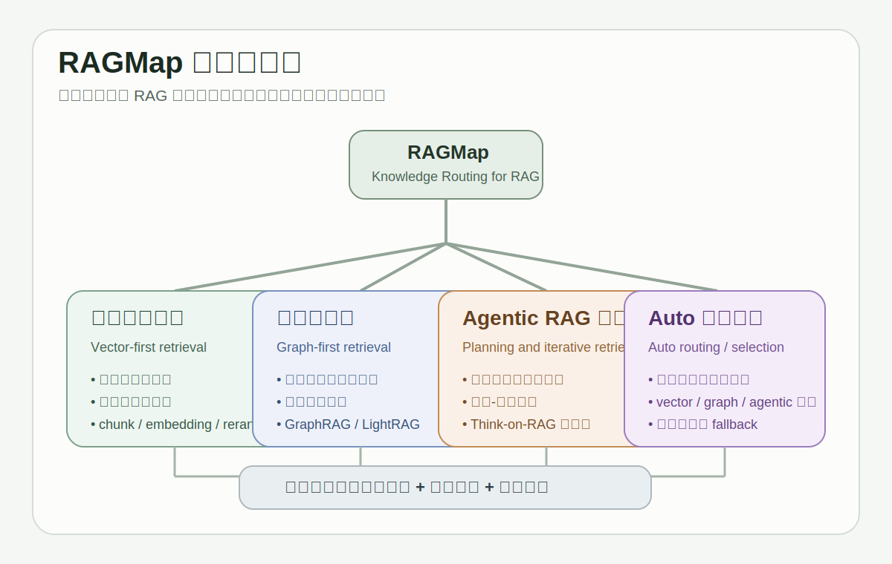

# RAGMap

> 一个面向中文读者的 RAG 学习与研究导航仓库。  
> 它关注的不是“收集了多少论文”，而是“RAG 为什么会这样演化，它下一步可能走向哪里”。

## 项目简介

`RAGMap` 试图把 Retrieval-Augmented Generation（RAG）梳理成一张可学习、可研究、可持续维护的方法地图。

这个仓库不把 RAG 看成单一技术点，而把它看成一个持续演化的系统问题：

- 从基础向量检索，到图结构增强；
- 从图式知识组织，到 memory-centric / cognitive 风格方法；
- 从“检索更多”走向“组织更好、推理更稳、规划更强”；
- 从单轮问答工具，走向复杂任务中的知识基础设施。

如果你想知道“某个方法是什么”，这里会给你入口；  
如果你更关心“它为什么出现、解决了什么、代价是什么、下一步还缺什么”，这里会尽量给你方法脉络。

## 为什么做这个项目

现有很多 RAG 资料存在几个常见问题：

- 论文罗列很多，但方法演进逻辑不清晰；
- 初学者能看到概念，却很难形成完整系统图；
- 研究者能看到局部创新，却不容易把它放回长期演化脉络；
- 不同社区对 GraphRAG、MemoryRAG、Reasoning RAG、CognitiveRAG 的讨论相互割裂。

`RAGMap` 希望解决的是“认知地图”问题：

- 帮初学者建立从 0 到 1 的理解框架；
- 帮研究者快速定位每一代方法在解决什么问题；
- 帮开发者理解工程取舍，而不是只看论文指标；
- 帮后续维护者持续扩展，而不是把仓库做成一次性笔记。

## 适合谁阅读

### 1. RAG 初学者 / 小白

如果你想回答下面这些问题，这个仓库适合你：

- 什么是 RAG，它和“直接让 LLM 回答”有什么不同？
- 标准向量化 RAG 是怎么工作的？
- 为什么会出现 chunking、embedding、retrieval、reranking？
- 为什么基础 RAG 很快就遇到瓶颈？
- 我应该按什么顺序学习，才不会一上来就被 GraphRAG 和复杂框架劝退？

### 2. RAG 研究者 / 开发者

如果你更关心以下问题，这个仓库同样适合你：

- RAG 的方法演进是否存在清晰主线？
- 基础 RAG、GraphRAG、LightRAG、HippoRAG、Thinking-oriented RAG 的设计差异是什么？
- 哪些方法在解决“召回问题”，哪些方法在解决“组织问题”，哪些方法在解决“推理问题”？
- CognitiveRAG 这类方法在整个谱系中处于什么位置？
- 未来的机会点更可能出现在 memory、planning、reasoning 还是 structured retrieval？

## RAG 演进路线总览

可以把近几年的 RAG 粗略看成下面几条连续演进线：

```text
基础向量化 RAG
  -> 发现局部语义匹配不够，难以处理全局关系与复杂问答
GraphRAG
  -> 用图结构组织知识，提升全局视角、多跳关联与社区摘要能力
轻量化 GraphRAG
  -> 保留结构化优势，同时压低构图和维护成本
Memory / Cognitive 风格 RAG
  -> 从“检索文档片段”转向“组织记忆单元与关联网络”
Reasoning-enhanced / Thinking-oriented RAG
  -> 从“找到相关内容”转向“动态拆解问题并规划检索路径”
CognitiveRAG
  -> 试图把理解、记忆、扩散、重排放进统一认知式知识流程
下一阶段
  -> retrieval + memory + reasoning + planning 的更深融合
```

## 方法演进时间线

> 这里给的是研究主线导航，不是严格年份断代。

| 阶段 | 核心代表 | 主要关注 | 关键收益 | 主要代价 |
| --- | --- | --- | --- | --- |
| 基础 RAG | 向量检索 + 重排 + 生成 | 先把相关上下文找回来 | 工程简单、落地快 | 上下文碎片化、全局关系弱 |
| GraphRAG | Microsoft GraphRAG | 把知识组织成图与社区摘要 | 多跳、主题级理解更强 | 构图、抽取、维护成本高 |
| 轻量化 GraphRAG | LightRAG 等 | 用更轻的结构化方案逼近图优势 | 效率更高、部署更轻 | 表达能力常弱于重图方案 |
| Memory RAG | HippoRAG、HippoRAG2 | 把知识从“片段库”升级为“记忆系统” | 更适合复杂关联检索 | 记忆构造与更新机制更复杂 |
| Thinking RAG | Think-on-RAG 等 | 检索与推理过程协同设计 | 复杂问题路径更清晰 | 延迟和推理开销更高 |
| CognitiveRAG | CognitiveRAG | 统一理解、记忆组织、全局扩散、认知重排 | 面向复杂语义与多跳任务 | 体系复杂，评估与工程化难度上升 |

## 每一代方法到底在解决什么问题

| 方法代际 | 为什么会出现 | 主要解决的问题 | 没有完全解决的问题 |
| --- | --- | --- | --- |
| 基础 RAG | LLM 参数知识有限、知识更新慢 | 外部知识接入、事实增强 | 全局关系、复杂推理、证据稳定性 |
| GraphRAG | 纯向量匹配对结构关系感知不足 | 全局组织、多跳链路、社区级摘要 | 图构建成本、动态更新难 |
| 轻量化 GraphRAG | 重图方案过重，难以普及 | 降低结构化检索门槛 | 复杂关系表达可能不够深 |
| Memory RAG | “找到片段”不等于“拥有记忆” | 知识组织、长期关联、可扩展记忆 | 如何稳定更新、遗忘与压缩 |
| Thinking RAG | 单次检索对复杂问题路径支持不够 | 查询分解、动态检索、过程性推理 | 推理成本、链路可控性 |
| CognitiveRAG | 检索、记忆、重排仍然割裂 | 认知式知识转换与多维组织 | 统一范式仍在探索阶段 |

## 方法对比导航

| 方法 | 核心单位 | 优势场景 | 典型局限 | 文档入口 |
| --- | --- | --- | --- | --- |
| 基础 RAG | 文本 chunk | FAQ、知识库问答、快速搭建 | 对复杂关系支持弱 | [docs/02-basic-rag.md](./docs/02-basic-rag.md) |
| GraphRAG | 实体/关系/社区 | 需要全局视角与多跳理解 | 预处理重、链路复杂 | [docs/04-graphrag.md](./docs/04-graphrag.md) |
| LightRAG | 轻量结构单元 | 想要结构化收益但资源有限 | 深层关系表达有限 | [docs/05-lightweight-graphrag.md](./docs/05-lightweight-graphrag.md) |
| HippoRAG | 记忆图谱 / 记忆网络 | 多跳问答、知识组织 | 记忆更新机制复杂 | [docs/06-memory-rag.md](./docs/06-memory-rag.md) |
| HippoRAG2 | 增强型记忆组织 | 更复杂推理与知识聚合 | 系统复杂度继续上升 | [docs/06-memory-rag.md](./docs/06-memory-rag.md) |
| Thinking-on-RAG | 检索路径 + 推理链 | 复杂问题拆解与逐步求解 | 成本更高、稳定性依赖设计 | [docs/07-thinking-rag.md](./docs/07-thinking-rag.md) |
| CognitiveRAG | 认知式知识单元 | 复杂语义、多维组织、全局扩散 | 仍需更多标准化验证 | [docs/08-cognitiverag.md](./docs/08-cognitiverag.md) |

## 学习路径推荐

### 路线 A：初学者

建议按下面顺序阅读：

1. [什么是 RAG](./docs/01-what-is-rag.md)
2. [基础 RAG](./docs/02-basic-rag.md)
3. [为什么基础 RAG 不够](./docs/03-why-basic-rag-is-not-enough.md)
4. [GraphRAG](./docs/04-graphrag.md)
5. [阅读路线图](./docs/10-reading-roadmap.md)

这条路线的目标不是追热点，而是先建立一个稳定的基础框架：

- 先理解 RAG 的最小闭环；
- 再理解基础方案为什么不够；
- 最后再看图、记忆、推理这些增强方向。

### 路线 B：研究者 / 开发者

建议按下面顺序阅读：

1. [为什么基础 RAG 不够](./docs/03-why-basic-rag-is-not-enough.md)
2. [GraphRAG](./docs/04-graphrag.md)
3. [轻量化 GraphRAG](./docs/05-lightweight-graphrag.md)
4. [Memory RAG](./docs/06-memory-rag.md)
5. [Thinking-oriented RAG](./docs/07-thinking-rag.md)
6. [CognitiveRAG](./docs/08-cognitiverag.md)
7. [RAG 的未来](./docs/09-future-of-rag.md)

这条路线更强调：

- 方法出现的因果关系；
- 架构设计的真实取舍；
- 下一阶段潜在研究切口。

## 项目结构

```text
RAGMap/
├── README.md
├── CONTRIBUTING.md
├── LICENSE
├── ROADMAP.md
├── references.md
├── glossary.md
├── faq.md
├── assets/
│   └── README.md
└── docs/
    ├── 01-what-is-rag.md
    ├── 02-basic-rag.md
    ├── 03-why-basic-rag-is-not-enough.md
    ├── 04-graphrag.md
    ├── 05-lightweight-graphrag.md
    ├── 06-memory-rag.md
    ├── 07-thinking-rag.md
    ├── 08-cognitiverag.md
    ├── 09-future-of-rag.md
    └── 10-reading-roadmap.md
```

## 文档入口

- [什么是 RAG](./docs/01-what-is-rag.md)
- [基础 RAG：从 chunk 到 generation](./docs/02-basic-rag.md)
- [为什么基础 RAG 不够](./docs/03-why-basic-rag-is-not-enough.md)
- [GraphRAG：从向量检索到图结构组织](./docs/04-graphrag.md)
- [轻量化 GraphRAG：效率与复杂度折中](./docs/05-lightweight-graphrag.md)
- [Memory / Cognitive 风格 RAG](./docs/06-memory-rag.md)
- [Reasoning-enhanced / Thinking-oriented RAG](./docs/07-thinking-rag.md)
- [CognitiveRAG：在演化脉络中的位置](./docs/08-cognitiverag.md)
- [RAG 的未来方向](./docs/09-future-of-rag.md)
- [阅读路线图](./docs/10-reading-roadmap.md)

## 常见研究创新切入点

如果你在找“还能往哪里做”，可以优先关注这些方向：

- 检索单元设计：chunk、entity、subgraph、memory node 是否应该统一？
- 检索目标函数：召回相关内容，还是召回最有用的推理支撑？
- 查询建模：用户问题能否先被分解、重写、扩展或规划？
- 知识组织：知识应该按文本、关系、事件、语义场、记忆层次来组织？
- 检索后重排：reranking 是否应该引入全局结构与任务意图？
- 证据融合：多来源证据如何去冗余、消冲突、保溯源？
- 长期记忆更新：新增知识如何写入、压缩、遗忘与重建？
- 全局与局部协同：文档局部细节与跨文档全局关系如何共同参与生成？
- 评测体系：复杂 RAG 是否需要超越 EM/F1/Recall 的新指标？

## 未来可视化占位

后续可以在 `assets/` 中补充图示，README 已预留展示位：

- `assets/rag-overview.svg`：RAG 总体流程图
- `assets/rag-evolution-map.svg`：RAG 演进路线图
- `assets/graphrag-vs-memoryrag.svg`：GraphRAG 与 MemoryRAG 对比图
- `assets/cognitiverag-diagram.svg`：CognitiveRAG 方法示意图

示意占位如下：




> 当前仓库已提供简易占位图，后续补正式图片时可直接覆盖以上路径。

## 后续维护说明

这个仓库设计成“知识仓库”而不是“一次性文章”：

- `README.md` 负责总览与导航；
- `docs/` 负责章节化展开；
- `references.md` 负责论文、项目、博客等参考线索；
- `ROADMAP.md` 负责后续维护优先级；
- 后续可逐步扩展为 GitHub Pages，但第一阶段先保证内容结构足够稳固。

维护时建议优先遵守三条原则：

1. 新内容必须说明它解决了什么问题。
2. 新方法必须放回演进脉络，而不是孤立介绍。
3. 新增资料优先增强导航价值，而不是单纯增加数量。

## 欢迎贡献

欢迎以下类型的贡献：

- 修正文档中的事实错误或表达不清之处
- 增加代表性方法与对比分析
- 补充更好的图示、表格与阅读路线
- 补充高质量 benchmark、开源实现与工程经验
- 帮助把某一章节写得更适合新人理解

贡献方式见 [CONTRIBUTING.md](./CONTRIBUTING.md)。

## License 建议

本项目当前采用 [CC BY 4.0](./LICENSE)。

原因很直接：

- 仓库主体是知识整理与文档写作；
- 允许他人转载、改编、再组织；
- 只要求保留署名，适合研究导航类开源项目传播。

如果未来仓库中增加较多可执行代码，可考虑将代码子目录改为 MIT，文档继续保留 CC BY 4.0。
